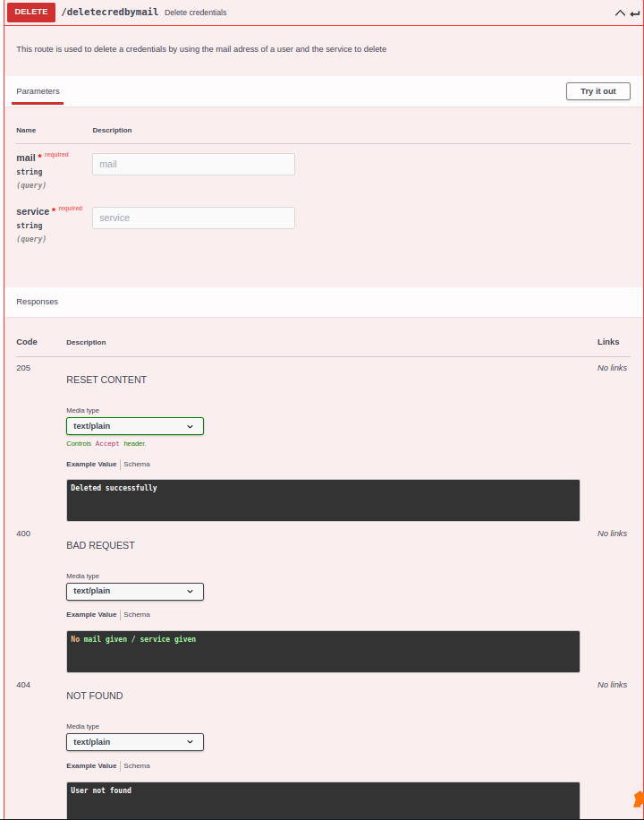
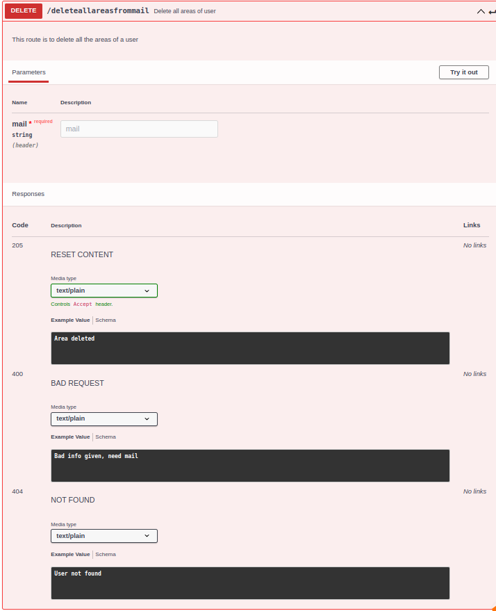

# Database interaction

## Table of Contents

- [Database interaction](#database-interaction)
  - [Table of Contents](#table-of-contents)
  - [About](#about)
  - [API documentation](#api-documentation)

## About

This folder is all about the database interaction, in this readme you will see how to use this service and what to exepect of it.

## API documentation

- How to use it ?
  - Simple, you jut have to run the: ```pip3 install``` command to install all the dependencies.
  - If you have some issue with psucopg2 use the following commands ```sudo pip install psycopg2-binary``` and ```sudo pip install psycopg2``` to fix it
  - Then you have to use ```python3 login.py``` if you want to interact with the login or credentails table.
    There! Now that the server is running on localhost:9020 you can try a simple /db/ping to check if everything is ok.

  - For the area table you just need to import the file in the python file that your working in

- EndPoints

  - First thing first to ping our database the route is the following : /db/ManipulateLogin/"endpoints" for the login table, /db/ManipulateCredentials/"endpoints" for the credntials table. Replace "enpoints" by one of the following endoints.

  - **/ManipulateLogin**
  - 
  - 
  - 
  - 
  - 
  - 
  - 
  - 
  - 
  - 
  - **/ManipulateCredentials**
  - 
  - 
  - 
  - 
  - 
  - 
  - 
  - 
  - 
  - 
  - 
  - **/ManipulateAreas**
  - 
  - 
  - 
  - 
