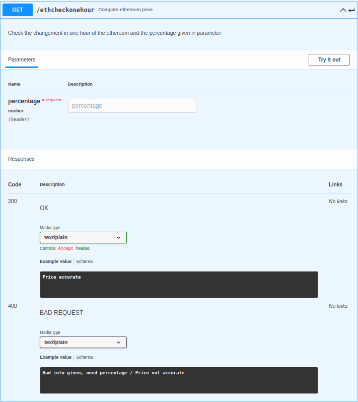

# Coingecko service

## Table of Contents

- [Coingecko service](#coingecko-service)
  - [Table of Contents](#table-of-contents)
  - [About](#about)
  - [API documentation](#api-documentation)

- [go_to_root](../../../README.md)

## About

This folder is all about the coingecko service, in this readme you will see how to use this service and what to exepect of it.

## API documentation

- How to use it ?
  - Simple, you jut have to run the: ```npm install``` command to install all the dependencies. Then you have to use ```node index.js``` to run the server.
    There! Now that the server is running on localhost:9040 on local or coingecko:9040 on our docker compose you can try a simple /coingecko/ping to check if everything is ok.

- EndPoints

  - First thing first to ping our coingecko service the route is the following : /coingecko/"endpoints" replace "enpoints" by one of the following endoints.

  - 
  - 
  - 
  - 
  - 
  - 
  - 
  - 
  - 
  - 
  - BITCOIN routes
  - 
  - 
  - 
  - 
  - ETHEREUM routes
  - 
  - 
  - 
  - 
  - BNB routes
  - 
  - 
  - 
  - 
  - BINANCE USD routes
  - 
  - 
  - 
  - 
  - SOLANA routes
  - 
  - 
  - 
  - 
