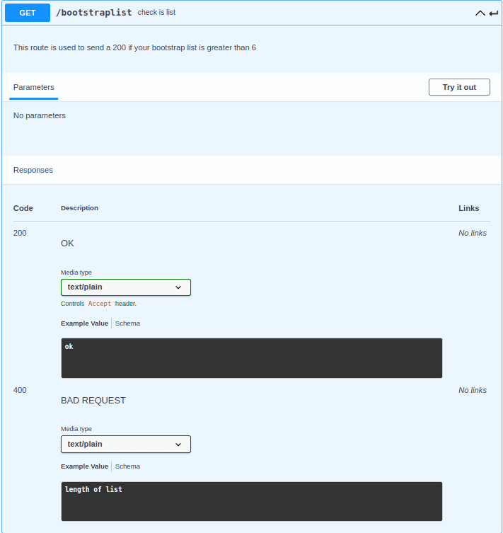
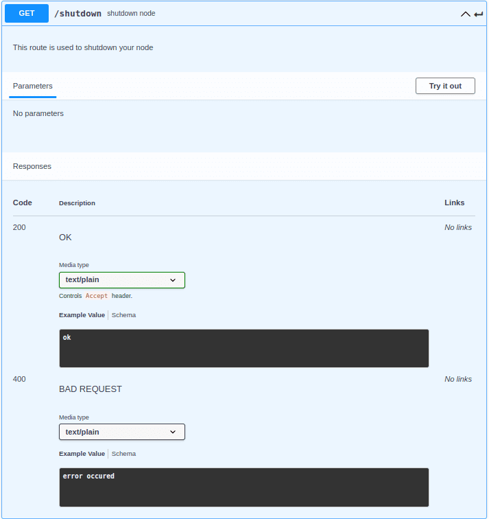

# IPFS service

## Table of Contents

- [IPFS service](#ipfs-service)
  - [Table of Contents](#table-of-contents)
  - [About](#about)
  - [API documentation](#api-documentation)

- [go_to_root](../../../README.md)

## About

This folder is all about the ipfs service, in this readme you will see how to use this service and what to exepect of it.

## API documentation

- How to use it ?
  - Simple, you jut have to run the: ```npm install``` command to install all the dependencies. Then you have to use ```node server.js``` to run the server.
    There! Now that the server is running on localhost:9030 on local or ipfs:9030 on docker you can try a simple /ipfs/ping to check if everything is ok.

- EndPoints

  - First thing fist to ping our ipfs services the route is the following : /ipfs/"endpoints" replace "enpoints" by one of the following endoints.

  - 
  - 
  - 
  - 
  - 
  - 
  - 
  - 
  - 
  - 
  - 
