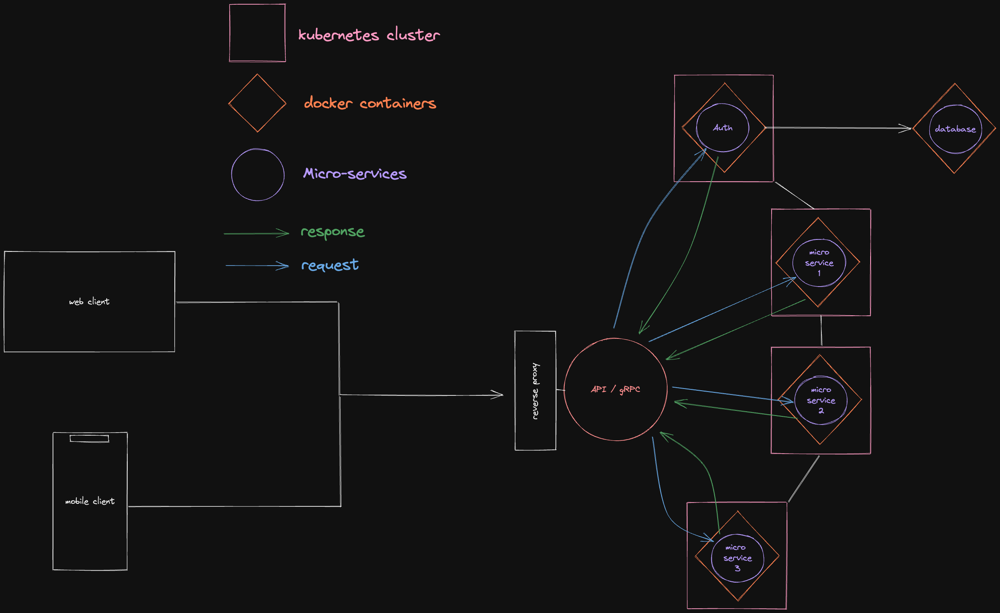

# Architecture Back-End

## Micro-Services

Microservices refer to an architectural approach to application development. As an architectural framework, microservices are distributed and loosely coupled, so changes made by one team do not affect the entire application. The advantage of microservices is that development teams are able to quickly build new application components to meet changing business needs.

A microservices architecture differs from a classic monolithic approach in that it breaks down an application to isolate its key functions. Each of these functions is called a “service” and these services can be developed and deployed independently of each other. Thus, each can function (or malfunction) without affecting the others. This helps you embrace the technology dimension of DevOps and simplify continuous iteration and delivery (CI/CD) while making it more accessible.

Advantage of micro-services: 
- Faster time to market As development
- High scalability
- Resilience
- Ease of deployment
- Accessibility
- Opening

## Serverless

With a serverless architecture, on the other hand, applications are launched only when needed. When an event triggers execution of application code, the public cloud provider allocates resources for that code dynamically. The user stops paying once the code is executed. In addition to the cost and efficiency benefits it offers, the serverless model frees developers from routine, menial tasks associated with scaling applications and provisioning servers.

Serverless computing makes it possible to outsource routine tasks such as operating system and file system management, security patching, load balancing, capacity management, scaling, logging, and monitoring.

We need to use a cloud provider to have benefits of serverless.

grpc --> http2  TLS.2
REST --> http1.1  TLS.3

## Future plans and schemas
