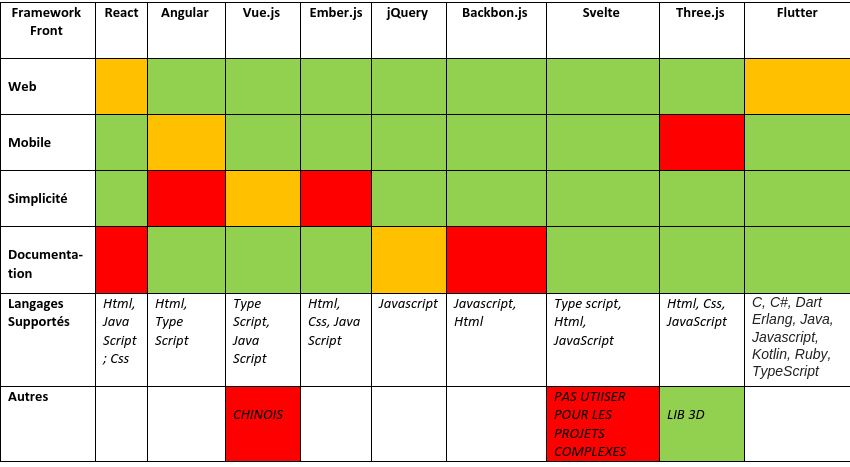

# What technologie to use ?

## Comparison of different technologies

First, let's compare different front framework. It will help us chose the one that match the best our expectations.
Multiple factors are going to influent our choises such as the complexity, documentation and more.

Bellow, our comparison board.

## Mobile Application Framework

Seeing all thoses pros and cons we can select a framework to use for the mobile application.

We are a groupe of five, this is why we need to choose one that will be easy to learn, easy to understand, with a really good documentation.

Indeed we choose Flutter to make our application because compare to jQuery, Ember.js or even Vue.js, Flutter is the one that corresponds the most.

It's one of the most use framework for mobile application because of it's rich libraries, the ability to test fast and ease bugs.

## Web Application Framework

Using the same method, we had to choose a different framework, that fit the best our needs to make the web application.

React is pretty simple, easier to learn and use than Angular.
What also guided us is that React focuses on creating reusable UI components while Vue.js or Blackbone.js doesn't.

We all have some notion of React witch help our choise. It's a great framework for web application, it propose a large liberty and it's easy to start.

We also wan to have an original UI/UX, fitting our graphical charter. With Three.js, we have a wide range of possibilities, to create or use disign we want. It's also very simple to use and to implement.

Moreover, React and Three.js are compatible, this is why we choose to use both.

