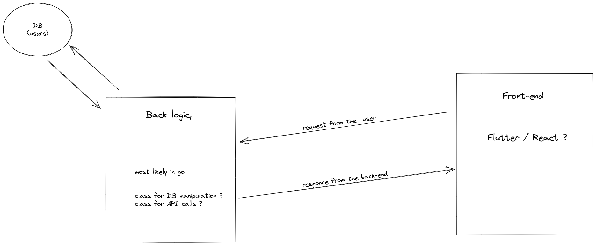
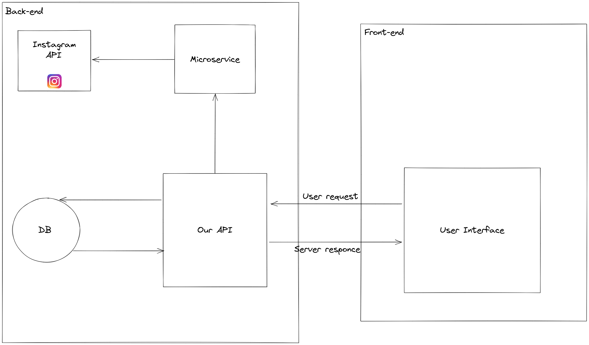

# Schema architecture back

## Synchronous 2-layer

- Code backend receive request. Layer 1
- Communicate with db (and or other things) and send respond back to client. Layer 2

Everything done synchronously.
Pretty simple for the dev and has many choice of tools/framework/libraries like php/mySQL etc
But has this method has several performance, stability and scalability problems

## Asynchronous 2-layer

- Same as the Synchronous 2 layer backend receive request communicate to with db and respond to client

The asynchronous work the same way as the synchronous
But everything is done asynchronously
Less problem of problem of scalability, performance and stability

- In our case:
 Asynchronous

We will use an asynchronous backend, for example if you are requesting an API and the user want to scroll or to look at something else on the website/app and he can't, well this is not user friendly

## Future plans and schemas

- Mock plan of our backend, database, frontend relation

- More detailed plan of our back-end, database, front-end realation with one micro-service example

## Our choices and why

- Why a database ?

  In this project we will have users, and they will have to register to access the rest of the content of our project, we will use OAuth2 to make things easier but if the user want he can register with just he's email and password if he do so we will need to stock these emails and passwords, we could use a simple configuration files with these email and password stock but if we want to commercialise this project and sell it to somebody we need to make a database.

- What services ?
  - coin gecko
  - nasa
  - pinterest
  - instagram
  - twitter
  - pokemon go
  - weather
  - gmail
  - discord
  - youtube
  - netflix
  - teams
  - postman
  - thunder bird
  - github
  - vinted
  - spotify
  - ratp
  - revolute
  - blablacar
  - ubisoft : does it exist ?
  - riotgames
  - google drive

- Why these services

    Because all of these services have public services with a good documentation and most of all, we have the possiblity to do action reaction stuff with these different api's wich is the purpose of this project.

sources:

[overwiew backend architecture 1](https://dev.to/siy/considerations-and-overview-of-web-backend-architectures-4613)

[overwiew backend architecture 2](https://ifttt.com/docs/process_overview)

[example backend architecture 1](https://zapier.com/blog/the-architecture-behind-zap-history-pages)

[example backend architecture 2](https://www.indeed.com/career-advice/career-development/what-is-backend-web-architecture#:~:text=Backend%20web%20architecture%20allows%20website,features%20of%20the%20finished%20webpage.)

[what is backend](https://www.codecademy.com/article/back-end-architecture)

[apié](https://apilist.fun/)
